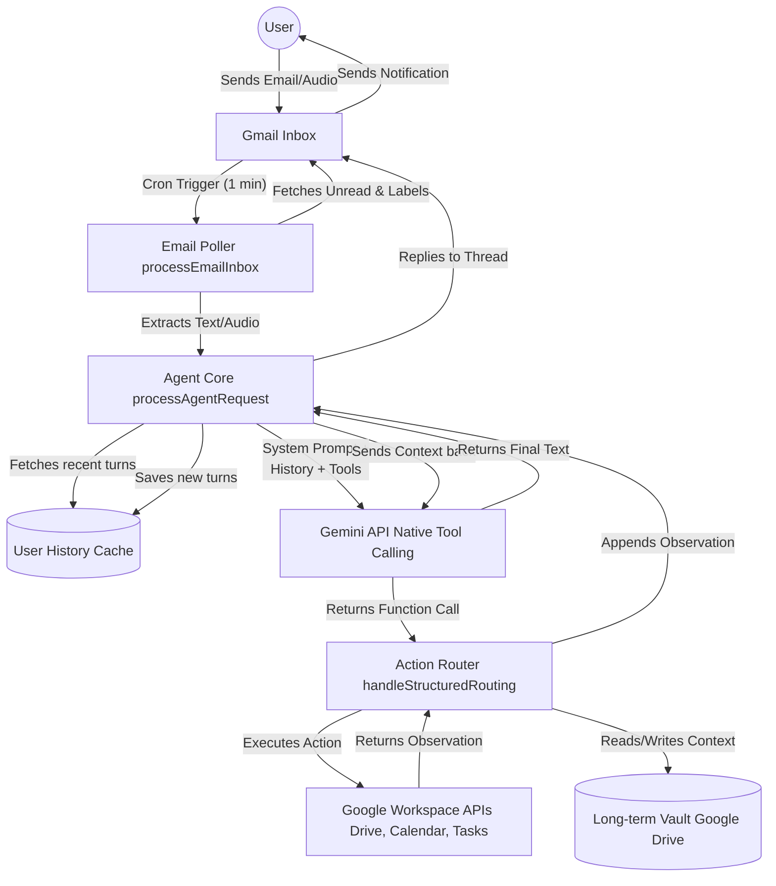
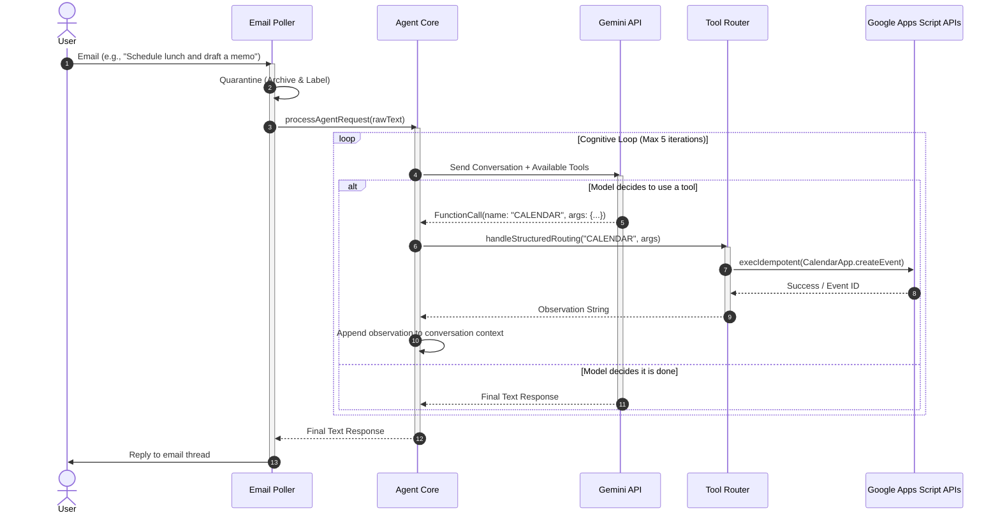

# Radlee Data Flow Architecture

Here is the data flow map for the Radlee AI Chief of Staff project. 

## High-Level Architecture Flow

This diagram illustrates how data enters the system, is processed by the Gemini engine, interacts with Google Workspace APIs via Tool Calling, and returns to the user.

---

## Detailed Execution Sequence

This sequence diagram breaks down the multi-turn Tool Calling loop that occurs when Radlee receives a complex request.

